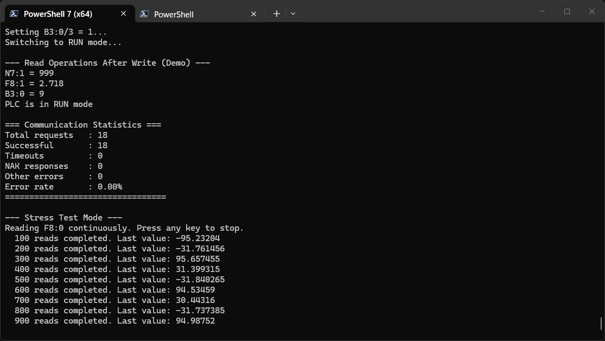

# PCCCComm Example Client

**Purpose**  
Enhanced PCCC client for testing `PCCCComm` against a real PLC or the PCCCEmulator. Supports DF1 serial, DF1 half‑duplex master, and EtherNet/IP (EIP) transports, interactive CLI, communication statistics, and stress testing.

> **⚠️ CAUTION – REAL PLC HAZARD**  
> This example client **writes data** to the connected PLC (N7, F8, B3, and mode switching).  
> Running the demo on a **real PLC** will modify its memory and may affect machine operation.  
> **Only use with a real PLC if you fully understand the consequences.**  
> For safe testing, use the [PCCCEmulator](../PCCCEmulator) instead.

## Features
- **Multi‑transport support**: DF1 full‑duplex, DF1 half‑duplex master (RS‑485), and EtherNet/IP (EIP) over TCP.
- Reads processor type (Get Status, CMD 0x06 FNC 0x03)
- Reads/writes integers (`N7`, `O0`, `I1`, `B3`)
- Reads/writes floating‑point values (`F8`)
- Bit‑level write (`B3:0/0`, `/3`)
- Switches processor between **RUN** and **PROGRAM** mode
- Retrieves data file directory (`GetDataMemory()`)
- **Interactive CLI** (`PCCC>` prompt) with read, write, writestring, sendhex, mode, stats, and more
- **Communication statistics** – total requests, successes, timeouts, NAKs, other errors, error rate
- **Stress test mode** – continuous read loop with configurable iteration count
- Configurable settings for serial (port, baud, parity, node IDs, checksum), EIP (host, port, timeout), and half‑duplex master (RS‑485 direction control, echo suppression)



*Example client stress test on PCCCEmulator*

## Requirements
- .NET 8 SDK or later
- `PCCCComm` library (referenced via project or DLL)
- A target PLC or emulator:
  - For DF1 full‑duplex: a real SLC 5/03 or MicroLogix with DF1 port, or the **PCCCEmulator** connected via virtual serial pair
  - For DF1 half‑duplex master: the **PCCCEmulator** in `df1slave` mode over an RS‑485 link (or a virtual pair with echo suppression)
  - For EIP: a real SLC 5/05 / CompactLogix / MicroLogix 1100/1400, or the **PCCCEmulator** (EIP mode)

## Build

With project reference (typical):
```bash
dotnet build -c Release Example.csproj
```

If `PCCCComm` is a separate project in the same solution, ensure the solution includes both `PCCCComm.csproj` and `Example.csproj` with a `ProjectReference`.

## Run

### DF1 Serial Mode (default)

**Default** (COM1, 19200, no parity, target node 1, local node 0, CRC checksum):
```bash
dotnet run --project Example.csproj -- COM1
```

### DF1 Half‑Duplex Master Mode (RS‑485)

```bash
dotnet run --project Example.csproj -- COM2 --mode df1master --target 1 --baud 19200 --rs485-mode auto
```

With manual RTS control and echo suppression (for full‑duplex loopback):
```bash
dotnet run --project Example.csproj -- COM2 --mode df1master --target 1 --rs485-mode rts --echo-suppression
```

### EtherNet/IP Mode

```bash
dotnet run --project Example.csproj -- --mode eip --host 192.168.1.10
```

Optional timeout (default 5000 ms):
```bash
dotnet run --project Example.csproj -- --mode eip --host 192.168.1.10 --timeout 3000
```

### Command line options

| Option | Description | Default |
|--------|-------------|---------|
| `[port]` | Serial port name (DF1 modes) | `COM1` |
| `--mode <df1\|df1master\|eip>` | Transport mode | `df1` |
| `--baud <n>` | Baud rate (DF1) | `19200` |
| `--parity <none/odd/even>` | Parity mode (DF1) | `none` |
| `--target <n>` | Target PLC node ID (slave address for DF1 master) | `1` |
| `--mynode <n>` | Local/master node ID | `0` |
| `--checksum <crc/bcc>` | Checksum mode (DF1) | `crc` |
| `--rs485-mode <auto\|rts\|dtr>` | RS‑485 direction control (DF1 master mode) | `auto` |
| `--echo-suppression` | Discard echoed bytes (for full‑duplex loopback) | `false` |
| `--rs485-assert-delay <ms>` | Delay after enabling driver (DF1 master) | `1` |
| `--rs485-deassert-delay <ms>` | Delay after last byte before disabling (DF1 master) | `5` |
| `--host <IP>` | PLC IP address (EIP, required) | – |
| `--eip-port <n>` | EIP port (EIP) | `44818` |
| `--timeout <n>` | EIP connection timeout ms (EIP) | `5000` |
| `--interactive-only` | Skip demo, go straight to interactive CLI | – |
| `--no-interactive` | Run demo only, then exit | – |
| `--stress-test [n]` | Run stress test; `n` = loop count (default: infinite) | – |
| `--help, -h` | Show usage | – |

### Linux‑specific notes (DF1 serial)

On Linux, serial ports are typically named `/dev/ttyS0`, `/dev/ttyUSB0`, `/dev/ttyACM0`, etc.  
The example client accepts both formats: with or without the `/dev/` prefix.

```bash
# Both work:
dotnet run --project Example.csproj -- ttyUSB0
dotnet run --project Example.csproj -- /dev/ttyUSB0
```

If the specified port is not found, the client will display a list of available `tty` devices.

> **Note**: Ensure your user has read/write access to the serial device. Add yourself to the `dialout` group if needed:
> ```bash
> sudo usermod -a -G dialout $USER
> # Log out and back in for changes to take effect
> ```

### Example with PCCCEmulator

#### DF1 full‑duplex virtual pair

**Windows** (using com0com):
1. Create a virtual COM pair, e.g. `COM1` ↔ `COM2`.
2. Start the emulator on `COM2`:
   ```bash
   dotnet run --project ../PCCCEmulator/PCCCEmulator.csproj -- COM2 --checksum crc
   ```
3. Run the example client on `COM1`:
   ```bash
   dotnet run --project Example.csproj -- COM1 --target 1 --checksum crc
   ```

**Linux** (using socat):
1. Create a virtual serial pair:
   ```bash
   socat -d -d pty,raw,echo=0,link=/dev/ttyV0 pty,raw,echo=0,link=/dev/ttyV1
   ```
2. Start the emulator on `/dev/ttyV0`:
   ```bash
   dotnet run --project ../PCCCEmulator/PCCCEmulator.csproj -- ttyV0 --checksum crc
   ```
3. Run the example client on `/dev/ttyV1`:
   ```bash
   dotnet run --project Example.csproj -- ttyV1 --target 1 --checksum crc
   ```

#### DF1 half‑duplex master ↔ slave

Start the emulator as slave on COM2:
```bash
dotnet run --project ../PCCCEmulator/PCCCEmulator.csproj -- COM2 --mode df1slave --node 1
```
Then run the example client as master on COM3:
```bash
dotnet run --project Example.csproj -- COM1 --mode df1master --target 1
```
> **Note:** For virtual serial pairs, which are full‑duplex, add `--echo-suppression` to both sides (or at least to the master) to discard self‑echo.

#### EIP (EtherNet/IP) loopback

Start the emulator in EIP mode:
```bash
dotnet run --project ../PCCCEmulator/PCCCEmulator.csproj -- --mode eip --port 44818
```

Then run the example client:
```bash
dotnet run --project Example.csproj -- --mode eip --host 127.0.0.1 --eip-port 44818
```

### Stress test example

DF1:
```bash
dotnet run --project Example.csproj -- COM1 --stress-test 500
```

EIP:
```bash
dotnet run --project Example.csproj -- --mode eip --host 192.168.1.10 --stress-test 500
```

Runs 500 continuous reads of `F8:0` (or another address), then prints communication statistics.

## Interactive CLI

When the demo completes (or with `--interactive-only`), the client enters an interactive prompt:

```
=== Interactive CLI Mode ===
Type 'help' for commands, 'exit' to quit.

PCCC>
```

### Interactive commands

| Command | Description |
|---------|-------------|
| `read <addr> [count]` | Read one or more elements from address |
| `write <addr> <val...>` | Write one or more integers to address |
| `writestring <addr> <text>` | Write string to an ST file address |
| `sendhex <DST> <CMD> <FNC> [data...]` | Send raw PCCC command as hex bytes |
| `mode` | Show current PLC mode (RUN / PROGRAM) |
| `setrun` | Switch PLC to RUN mode |
| `setprog` | Switch PLC to PROGRAM mode |
| `type` | Show processor type code |
| `stats` | Show communication statistics |
| `resetstats` | Reset statistics counters |
| `exit` / `quit` | Exit interactive mode |
| `help` | Show command list |

#### `sendhex` detail

Sends a raw PCCC PDU. SRC and TNS are auto‑generated by the library; DST, CMD, and FNC are specified by the user.

```
PCCC> sendhex 01 0F A1 02 11 89 00
```

## Expected output (successful DF1 run)

```
DF1: Connecting to COM1 @ 19200 baud, None parity, checksum=Crc
MyNode=0, TargetNode=1
DF1 port opened successfully

Processor Type: 0x49

--- Read Operations (Demo) ---
O0:0 = 513
I1:0 = 0
B3:0 = 0
N7:0 = 123
F8:0 = 1.23
PLC is in RUN mode

--- Data Files ---
File 0: Type=1 Elements=...
File 1: Type=139 Elements=...
...

--- Write Operations (Demo) ---
Writing 999 to N7:1...
Writing 2.718 to F8:1...
Setting B3:0/0 = 1...
Setting B3:0/3 = 1...
Switching to PROGRAM mode...

--- Read Operations After Write (Demo) ---
N7:1 = 999
F8:1 = 2.718
B3:0 = 9
PLC is in PROGRAM mode

=== Communication Statistics ===
Total requests   : 14
Successful       : 14
Timeouts         : 0
NAK responses    : 0
Other errors     : 0
Error rate       : 0.00%
=================================

=== Interactive CLI Mode ===
Type 'help' for commands, 'exit' to quit.

PCCC>
```

## Troubleshooting

| Issue | Solution |
|-------|----------|
| `No response, Check COM Settings` | Verify the COM port is correct, baud rate/parity match the target, and the target is powered on. |
| `Checksum mismatch` | Ensure `--checksum` matches the target's setting (both default to CRC). |
| `Illegal Command or Format` | The target may not support the addressed file/element. Check file numbers and element bounds. |
| `Processor is in Program mode` | Normal – some commands are restricted. Use `setrun` in the CLI or `SetRunMode()` to change. |
| `Access denied` | Some DF1 targets have command protection. Not supported by this example. |
| `PrefixAndSend method not found` | `sendhex` uses reflection on a private method. Ensure `PCCCComm` library version matches. |
| **EIP connection refused / timeout** | Verify the emulator or PLC is running in EIP mode, firewall allows TCP port 44818, and `--host`/`--eip-port` are correct. |
| **Half‑duplex master does not communicate** | Ensure emulator is in `--mode df1slave` with matching node ID. For virtual serial pairs, use `--echo-suppression`. Check RS‑485 direction control settings. |

## License

Same as the PCCCComm library.

## See also

- [PCCCEmulator](../PCCCEmulator) – standalone emulator for testing DF1 and EIP
- [PCCCComm Library Documentation](https://github.com/kumajaya/PCCCComm)
