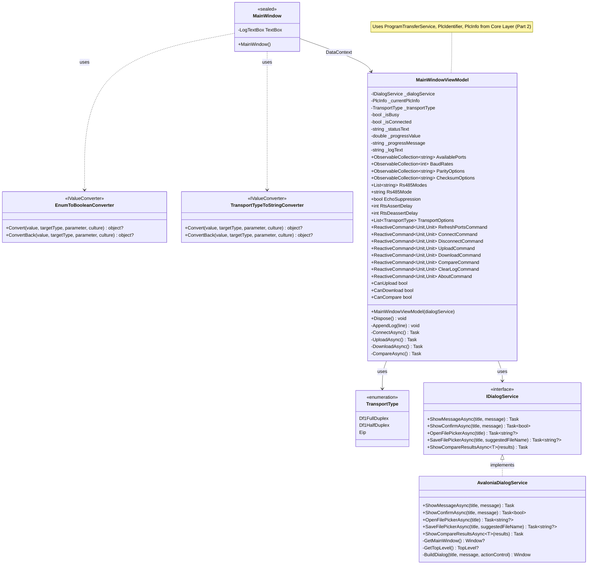
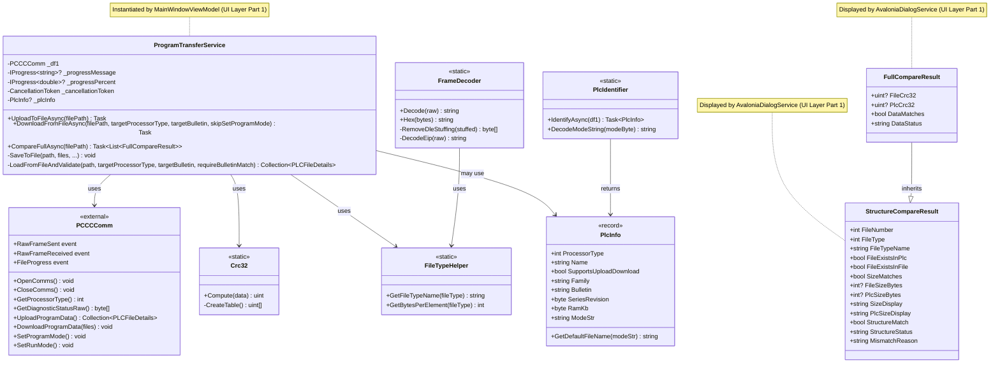

# PCCCImageTool – Desktop GUI for PLC Upload/Download

**Purpose**  
Cross‑platform desktop GUI (Avalonia UI) that uploads the complete program from an Allen‑Bradley SLC or MicroLogix PLC to a binary file, and restores it back to a compatible controller. Designed as a lightweight, stand‑alone alternative for program backup and restore without RSLogix.

> **⚠️ CAUTION – REAL PLC HAZARD**  
> This tool performs **download** which overwrites the entire PLC program, including ladder logic and data tables.  
> Running download on a **real PLC** will **erase the existing program** and replace it with the contents of the selected file.  
> This may cause unexpected machine motion, loss of safety functions, or production downtime.  
> **Only use this tool on a real PLC if you fully understand the consequences and have a verified backup.**  
> For safe testing, use the [PCCCEmulator](../PCCCEmulator) first.

## Features
- Automatic **PLC detection** – processor type, family, and run/program mode.
- **Upload** – reads all program and data files, saves to a compact binary file (`.bin`) with a descriptive name.
- **Download** – restores a previously uploaded program to the same PLC family.
- **Compare** – compares a backup file against current PLC program, shows mismatches in file structure and CRC32 data.
- **Supports** SLC 5/01–5/05, MicroLogix 1000/1500, and PLC‑5 (bulk physical transfer).
- **Graphical COM port selection** – baud rate, parity, and node address configurable.
- **DF1 half‑duplex master** support for RS‑485 multi‑drop networks (selectable in transport dropdown).
- **RS‑485 direction control** (Auto / RTS / DTR) and echo suppression configurable in GUI.
- **Progress indication** – shows current file being transferred.
- **Self‑contained** – uses only the PCCCComm library, no external UI dependencies.
- **⚠️ Download overwrites PLC memory** – use with extreme caution on real hardware

## Screenshots


*Main window after downloading PCCCEmulator internal memory*


*Compare dialog showing differences between backup file and PLC memory*

## Requirements
- .NET 8 SDK or later
- Windows / Linux / macOS (serial port support required)
- For testing without hardware: virtual serial pair + PCCCEmulator (included in the same repository)

## Build
From the repository root:
```bash
dotnet build src/PCCCImageTool/PCCCImageTool.csproj
```

Or build the whole solution:
```bash
dotnet build PCCCComm.sln
```

## Run
```bash
dotnet run --project src/PCCCImageTool
```

**Command line options** – none (all settings are configured in the GUI).

## Transport Modes

The tool supports three transport modes, selectable from the **Transport** dropdown:

| Mode | Description |
|------|-------------|
| **DF1 Full Duplex** | Standard point‑to‑point RS‑232 communication (default). |
| **DF1 Half Duplex (Master)** | RS‑485 multi‑drop master. Polls a specific slave address. |
| **EtherNet/IP** | TCP/IP communication over port 44818. |

When **DF1 Half Duplex (Master)** is selected, additional settings appear:
- **RS‑485 Mode** – Auto (hardware auto‑direction), RTS, or DTR.
- **Echo Suppression** – Discard echoed bytes when using full‑duplex loopback (e.g., virtual serial pairs).
- **RTS Assert Delay (ms)** – Delay after enabling driver before writing.
- **RTS Deassert Delay (ms)** – Delay after last byte before disabling driver.

The **Target Node** field is reused as the slave address (1‑254) in half‑duplex master mode.

## Linux-specific notes

### Permissions
Ensure your user has read/write access to the serial device. Add yourself to the `dialout` group if needed:
```bash
sudo usermod -a -G dialout $USER
# Log out and back in for changes to take effect
```

### No serial ports detected

On some Linux systems, `SerialPort.GetPortNames()` may return an empty list even when devices are present.  
PCCCImageTool detects this and provides a fallback list of typical device names:

- `/dev/ttyS0`   – legacy serial port
- `/dev/ttyUSB0` – USB‑to‑serial adapter (most common)
- `/dev/ttyACM0` – Arduino / modem style devices
- `/dev/ttyS31`  – a high‑numbered port intended for symbolic links

If your device uses a different name (e.g. `/dev/ttyUSB1`), you can create a symlink to one of the listed names:

```bash
sudo ln -s /dev/ttyUSB1 /dev/ttyS31
```

Then select `/dev/ttyS31` from the port list in the GUI.

## Testing with the PCCCEmulator

### DF1 Full‑Duplex (default)

1. Create a virtual serial pair (e.g. `COM1` ↔ `COM2` on Windows, or `ttyV0` ↔ `ttyV1` using `socat` on Linux).
2. Start the emulator on one end:
   ```bash
   dotnet run --project src/PCCCEmulator -- COM2 --checksum crc
   ```
3. Start PCCCImageTool and connect to the **other** end (`COM1` or `ttyV1`).
4. Upload, then download – the emulator behaves like a real SLC 5/03.

### DF1 Half‑Duplex Master ↔ Slave

1. Create a virtual serial pair (e.g. `COM3` ↔ `COM4`).
2. Start the emulator as **slave** on one end (e.g., COM4):
   ```bash
   dotnet run --project src/PCCCEmulator -- COM4 --mode df1slave --node 1 --baud 19200
   ```
3. Start PCCCImageTool, select **DF1 Half Duplex (Master)** in the Transport dropdown, set:
   - COM Port: the other end (e.g., COM3)
   - Target Node: same as slave node (1)
   - RS‑485 Mode: Auto (or RTS/DTR if needed)
   - Echo Suppression: **unchecked** (for real RS‑485 or null modem cable; enable only if using a full‑duplex loopback)
4. Click Connect, then upload/download/compare as usual.

> **Note:** For virtual serial pairs (which are full‑duplex), enable **Echo Suppression** on the master side to discard self‑echo. For real RS‑485 hardware with auto‑direction, leave it disabled.

### EtherNet/IP Loopback

Start the emulator in EIP mode:
```bash
dotnet run --project src/PCCCEmulator -- --mode eip --port 44818
```

Then in PCCCImageTool, select **EtherNet/IP**, enter `127.0.0.1` as host, and connect.

## File format

The generated `.bin` file contains a raw PCCC memory snapshot with a comprehensive header and integrity checks:

| Offset | Content                                       |
|--------|-----------------------------------------------|
| 0      | Magic number `0xDF1A`                         |
| 2      | Version (current `1`)                         |
| 3      | Processor type (int32)                        |
| 7      | Series/revision (byte)                        |
| 8      | RAM size in KB (byte)                         |
| 9      | Family tag (8 bytes, ASCII, e.g. "SLC    ")   |

**Per‑file record (version 1):**

| Field | Size | Description |
|-------|------|-------------|
| FileNumber | 4 bytes | File index |
| FileType | 4 bytes | File type code (0x20 = LAD, 0x01 = SYS) |
| NumberOfBytes | 4 bytes | File size in bytes |
| DataLength | 4 bytes | Actual data length |
| Data | DataLength bytes | Raw program binary |

**Per‑file record (version 2, adds `PhysicalAddress`):**

| Field | Size | Description |
|-------|------|-------------|
| FileNumber | 4 bytes | File index (= segment index for PLC‑5) |
| FileType | 4 bytes | File type code |
| NumberOfBytes | 4 bytes | File size in bytes |
| PhysicalAddress | 4 bytes | PLC‑5 physical start address (0 for SLC) |
| DataLength | 4 bytes | Actual data length |
| Data | DataLength bytes | Raw program binary |
| 17     | Bulletin length (int32)                       |
| 21     | Bulletin string (UTF‑8, e.g. "5/03")          |
| 21+len | Timestamp (int64, UTC binary)                 |
| 29+len | Number of files (int32)                       |
| 33+len | For each file:                                |
|        | - File number (int32)                         |
|        | - File type (int32)                           |
|        | - Number of bytes (int32)                     |
|        | - Data length (int32)                         |
|        | - Raw data                                    |
| End    | CRC32 (uint32) of all preceding data          |
| End+4  | SHA256 (32 bytes) of all preceding data       |

This format is **not compatible** with `.RSS` files from RSLogix; it is intended only for exchange between PCCC‑based tools.  
The file includes both CRC32 and SHA256 checksums to detect accidental corruption and intentional tampering.  
During download, the tool validates the processor type and bulletin against the target PLC to prevent mismatched downloads.

## Troubleshooting

| Issue | Likely solution |
|-------|------------------|
| **Not connected** after click | Check cable, baud rate, parity, and target node ID. Ensure the PLC is in REM position (for SLC 5/03/04). |
| **Upload/Download buttons disabled** | PLC type not supported or identification failed. MicroLogix 1400 upload/download via PCCC is not supported. |
| **Invalid Address** during download | The selected binary file does not match the target PLC memory layout (different processor family). |
| **Dialog hangs / no reaction** | Run from a terminal to see debug output; ensure the main window is not hidden. |
| **PLC stopped working after download** | You downloaded a program file that is not compatible with your PLC. Restore the original backup using RSLogix or this tool if a correct backup exists. |
| **Compare shows mismatches** | Normal if the PLC program has changed since the backup was created. Use Upload to create a fresh backup. |
| **EIP connection timeout** | Check firewall (TCP/UDP 44818). Ensure emulator or PLC is reachable. |
| **Half‑duplex master cannot communicate** | Verify that the emulator is in `--mode df1slave` with matching node ID. For virtual serial pairs, enable **Echo Suppression**. Check RS‑485 direction control settings. |
| **No communication in half‑duplex mode** | Ensure both sides use the same baud rate, parity, and checksum. For real RS‑485, the converter may need `--rs485-mode rts` and appropriate delays. |

## Project structure
The following class diagram illustrates the main components of PCCCImageTool and their relationships, following the MVVM pattern with ReactiveUI:

### Part 1 – UI Layer


### Part 2 – Core Layer


| File | Description |
|------|-------------|
| `Program.cs` | Application entry point |
| `App.axaml` / `App.axaml.cs` | Avalonia application setup |
| `Converters/EnumToBooleanConverter.cs` | Convert transport type to boolean |
| `Converters/TransportTypeToStringConverter.cs` | Convert transport type to string |
| `Models/CompareResult.cs` | Comparison result data structure |
| `Models/FileTypeHelper.cs` | PCCC file type to string conversion |
| `Models/PlcInfo.cs` | PLC type information |
| `Models/TransportType.cs` | Transport type enumeration |
| `Services/AvaloniaDialogService.cs` | Dialog service implementation for Avalonia |
| `Services/FrameDecoder.cs` | PCCC transport frame decoder for logging |
| `Services/IDialogService.cs` | Dialog service interface |
| `Services/PlcIdentifier.cs` | Processor type detection |
| `Services/ProgramTransferService.cs` | Upload/download and file serialisation |
| `Utilities/Crc32.cs` | Small CRC32 helper (IEEE 802.3 polynomial 0xEDB88320) |
| `Views/MainWindow.axaml` | Main window XAML layout |
| `ViewModels/MainWindowViewModel.cs` | MVVM logic for communication and transfer |

## License
Same as the PCCCComm library (GPLv3+).

## Contributing
- Fork, create a feature branch, and open a pull request.
- Test with both the PCCCEmulator and real hardware when possible.
